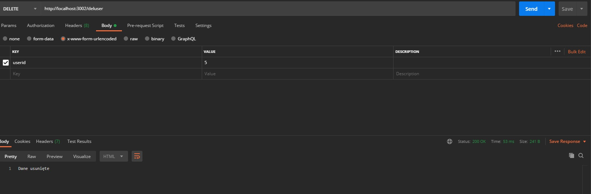

# Projekt zaliczeniowy Api - Rejestracja uczestników na zawody

### Api zawierajaca: 
* Dodawanie danych uczestników
* Sprawdzenie już zarejestrowanych uczestników
* Sprawdzenie hasła z loginem
* Prymitywne zabezpieczenie od atak sql iniekcji
* Usuwanie danych uczestników

#### Język: JavaScript
#### Baza: mySql

### app.js 
> eksport routerów, podłączenie css, startowanie servera


### Użytkowniki z bazy
```
router.get('/users', (request, response) => {
    //const mysql = require("mysql2");
    const connection = mysql.createConnection({
      host: "localhost",
      port: "3303",
      user: "node",
      database: "expapi",
      password: "111111"
    });
    connection.execute("SELECT * FROM users",
  function(err, results, fields) {
    console.log(err);
    response.send(results); // dane
    //console.log(fields); // 
});
connection.end();

  console.log("Połączenie zamknięte");
});
```
### Sprawdzenie hasła z loginem 
```
router.post('/check', (request, response) => {  //sprawdzenie hasła z loginem
    
    let userName=request.body.name+""; 
    let userPass=request.body.pass+"";
    var flag=true;

    if (userName.indexOf("'")>=0 || userName.indexOf(";")>=0 || userName.length==0){
        flag=false;
        response.send(flag);        
        return;        
    }
  
    if (userPass.indexOf("'")>=0 || userPass.indexOf(";")>=0 || userPass.length==0){
        flag=false;
        response.send(flag);        
        return;
    }
    if(flag){
        //const mysql = require("mysql2");    
        const connection = mysql.createConnection({  //połączenie do bazy
        host: "localhost",
        port: "3303",
        user: "node",
        database: "expapi",
        password: "111111"
        });
            
        const sqlSel = "SELECT count(*) as cc FROM users WHERE name='"+userName+"' and pass= '"+userPass+"' ";
        //
        try{ //sprawdzenie błędów
            connection.execute (sqlSel,function(err, results){ //wykonujemy SELECT
                var cc=results[0].cc;
                console.log("Dane CC:"+cc);
                
                if(cc>0){
                    response.send(flag);       
                }else{
                    flag=false;
                    response.send(flag);        
                }

            });
        }catch( Exeptions   ){
            console.log("Exeption DB: "+Exeptions);
        }finally{
            connection.end;

        }

    }    
});
```
### Sprawdzenie poprawnego pola (sql iniekcja)
```
let teststring=request.body.userName+""; 
if (teststring.indexOf("'")>=0 || teststring.indexOf(";")>=0 || teststring.length==0){
    response.send("Wprowadż poprawną nazwę");
    return;
}
teststring=request.body.userPhone+""; 
if (teststring.indexOf("'")>=0 || teststring.indexOf(";")>=0 || teststring.length==0){
    response.send("Wprowadż poprawny numer telefonu");
    return;
}
teststring=request.body.userEMail+""; 
if (teststring.indexOf("'")>=0 || teststring.indexOf(";")>=0 || teststring.length==0){
    response.send("Wprowadż poprawny mail");
    return;
}
teststring=request.body.userPassword+""; 
if (teststring.indexOf("'")>=0 || teststring.indexOf(";")>=0 || teststring.length==0){
    response.send("Wprowadż prawidłowe Hasło");
    return;
}

let repassword = request.body.userRePassword+"";
if (repassword.indexOf("'")>=0 || repassword.indexOf(";")>=0 || repassword.length==0){
    response.send("Wprowadż prawidłowe Hasło");
    return;
}
```
###  porównanie hasła - jeśli nie są podobne-wyświetla się błąd
```
if (!(teststring == repassword) ){
    response.send("Twoje hasła są różne");
    return;
}else{
    console.log("Twoje hasła są NIE różne");
   
}
```
### Dodawanie danych
```
const connection = mysql.createConnection({
      host: "localhost",
      port: "3303",
      user: "node",
      database: "expapi",
      password: "111111"
    });
    
    //żądanie na duplikatu rekordu
    const sqlSel = "SELECT count(*) as cc FROM users WHERE name='"+request.body.userName+"' ";
    //

    connection.execute (sqlSel,function(err, results){  
    var cc=results[0].cc; 
    console.log("Dane CC:"+cc);

    if(cc>0){  //Jeżeli dane istnieją
        console.log("Dane CC>0: "+cc);

        response.send("Użytkownik jest już zarejestrowany");
        return;
    }else{ //jeżeli nie ma - dodamy
        const user = [request.body.userName, request.body.userPhone, request.body.userEMail, request.body.userPassword ];

        const sql = "INSERT INTO users(name, phone, mail, pass) VALUES(?, ?, ?, ?)";
    
        connection.query(sql, user, function(err, results) {
            if(err) console.log(err);
            else console.log("Dane dodane");
        });
        response.send("Dane dodane");
    }

    });


    connection.end; 


});
```
### Wywołanie strony html 
```
router.get('/register', (request, response) => { 
    const http = require("http");
    const fs = require("fs");

    const filePath = "register.html";
    
    fs.access(filePath, fs.constants.R_OK, err => {
        
        if(err){
            response.statusCode = 404;
            response.end("Resourse register.html not found!"+err.message);
        }
        else{
            var fileStream =fs.createReadStream(filePath);
            response.writeHead(200, {'Content-Type': 'text/html'});
            fileStream.pipe(response);
        }
      });

});
```
### usunięcie danych
```
router.delete('/deluser', (request, response) => {
    

 const userIndex = request.query.userid
 console.log("Dane request:"+userIndex);

 if (userIndex === -1) return response.status(404).json({})

 if (userIndex.indexOf("'")>=0 || userIndex.indexOf(";")>=0 || userIndex.length==0){
    response.send("Wprowadż poprawne userIndex");
    return;
 }


const connection = mysql.createConnection({
    host: "localhost",
    port: "3303",
    user: "node",
    database: "expapi",
    password: "111111"
  });
  

const sqlSel = "DELETE FROM users WHERE iduser='"+userIndex+"'";
        //
    try{          
           connection.execute (sqlSel,function(err, results){ 
           if(err) console.log(err);
           else console.log("Dane usunięte");
           
        });
    }catch( Exeptions   ){
        console.log("Exeption DB: "+Exeptions);
    }finally{
        connection.end;

    }

//console.log("Данные userIndex:"+userIndex);


response.send("Dane usunięte");
 
})

module.exports = router;
```
## Przykłady działania
### Baza danych użytkowników

### Dodawanie danych w Postmanie

### Sprawdzenie imienia i hasła

### Usuwanie danych

### Dodawanie danych w html


### Jeżeli użytkownika nie ma w bazie:

### Jeżeli użytkownik już ma dane w bazie:

### Walidacji


